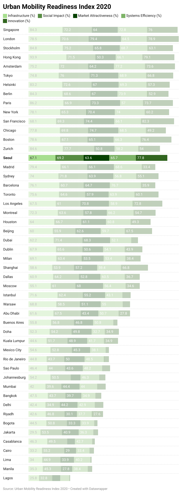

| [home page](https://cheejulee.github.io/christine-dataviz-portfolio/) | [data viz examples](dataviz-examples) | [critique by design](critique-by-design) | [final project I](final-project-part-one) | [final project II](final-project-part-two) | [final project III](final-project-part-three) |

# Christine Lee's Portfolio
This is my public portfolio for Telling Stories with Data at CMU!  Here's where all my cool work will go. 

- Web page URL: https://cheejulee.github.io/christine-dataviz-portfolio/

# About me
Hi, my name is Christine Lee and I am currently pursuing a Master of Entertainment Industry Management degree at Carnegie Mellon University's Heinz College. I was born in Columbus, OH but I've lived in Seoul, South Korea for more than half of my life. My Korean name is Heeju Lee, which means "pillar of hope". I hope this portfolio can give you a glimpse into my data visualization skills.

# What I hope to learn
All the things - obviously. But mostly
1. How to think about data so I can create effective data visualizations
2. How to critique data visualizations so they become effective
3. Tools for creating data visualizations

# Portfolio

# Examples

## Final project

For my final project, I decided to highlight the diversity representation gap between audience demand and the current reality of representation in TV series. My objective was to convince content development and television executives that diverse ethnic and racial representation on the screen leads not only to economic success, but also to critical acclaim and audience engagement. The final call to action was that more productions with BIPOC leads should be greenlit for the aforementioned reasons. 

[Part I](final-project-part-one)
[Part II](final-project-part-two)
[Part III](final-project-part-three)

## References
_List any references you used here._

## AI acknowledgements
_If you used AI to help you complete this assignment (within the parameters of the instruction and course guidelines), detail your use of AI for this assignment here._

