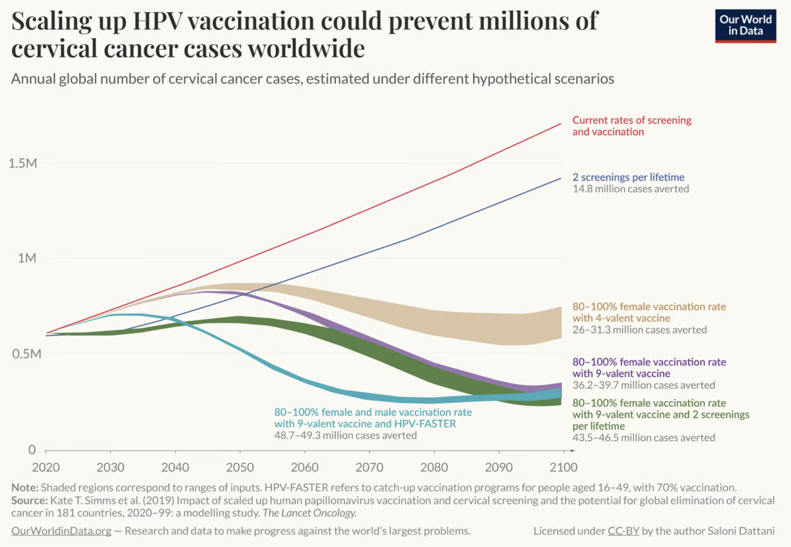
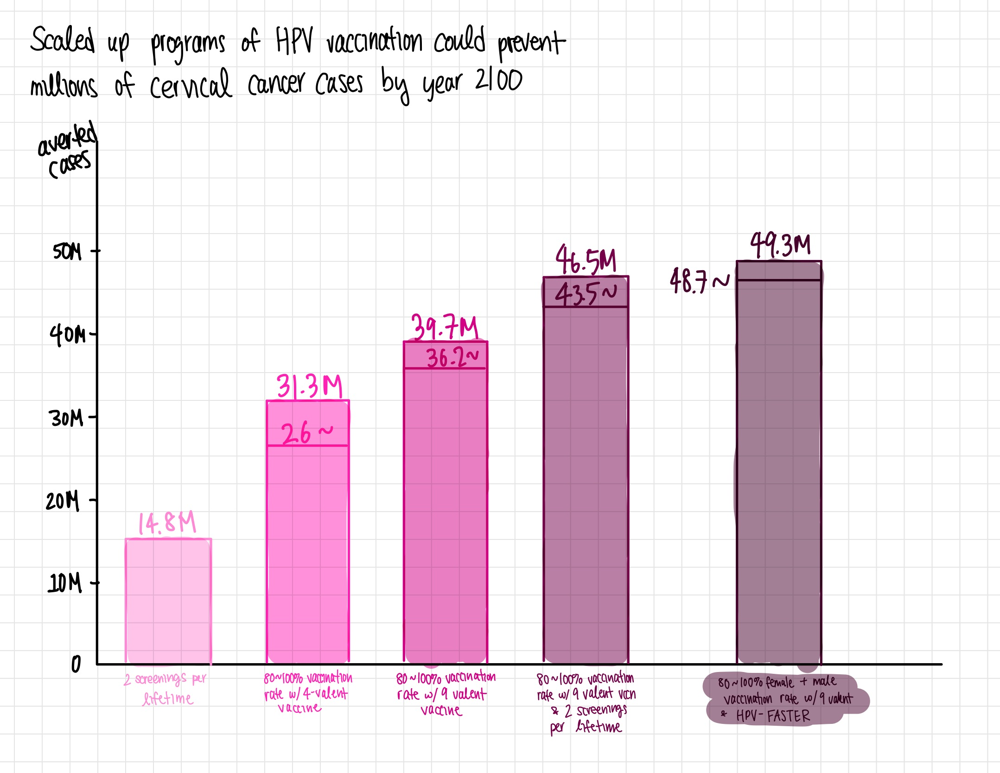

| [home page](https://cheejulee.github.io/christine-dataviz-portfolio/) | [data viz examples](dataviz-examples) | [critique by design](critique-by-design) | [final project I](final-project-part-one) | [final project II](final-project-part-two) | [final project III](final-project-part-three) |

# HPV vaccination: How the world can eliminate cervical cancer

## Step one: the visualization

Dattani, Saloni, and Veronika Samborska. “HPV Vaccination: How the World Can Eliminate Cervical Cancer.” Our World in Data, November 4, 2024. https://ourworldindata.org/hpv-vaccination-world-can-eliminate-cervical-cancer. 

I selected this visualization because I was interested in the study and wanted to gain a better understanding of HPV vaccination impact. I've come to know that cervical cancer is one of the most preventable cancers mostly due to HPV vaccinations. As it is a very accessible method for maintaining women's health, I have also seen public awareness campaigns encouraging both men and women to receive HPV vaccinations. Redesigining a visualization from this study contribute to raising awareness and educate myself better so I could discuss these matters in a more knowledgeable manner. 

## Step two: the critique

*Overall scores*
Usefulness: 4/10
Perceptibility: 4/10
Intuitiveness: 4/10
Aesthetics: 6/10
Truthfulness: 7/10
Completeness: 8/10
Engagement: 8/10

Initial observations:
- Use of color is unclear (using red for "current rate" seems inappropriate as red is a more impactful color that draws more attention when the purpose of the graph should be to focus on the impact of scaled up programs)
- Line graph is confusing and had to really look at the y-axis and x-axis values to understand what was going on
  - The spread or range of values shown in each line is supposedly pertaining to the 80-100% values with the lower values of averted cases 
- Cases averted part seem more impactful and important

Primary audience:
- Public health policymakers to convince them that scaling up HPV vaccinations would be beneficial
- Effective in targeting that audience with a straightforward title and purpose
- But falters in execution due to the use of a line graph with no standout values marking the line
  - Multiple colors also makes it confusing to interpret upon initial survey

Recommendations:
- Limit the use of color to one gradient with the deeper colors signifying higher impact
- Change the visualization type to a bar graph without the current rates of screening and vaccination
  - Compare the impact by changing the y-value to the number of cases averted by the year 2100 and x-axis would be different hypothetical programs

## Step three: Sketch a solution

## Step four: Test the solution

Questions: 

1. Can you tell me what you think this is?
2. Can you describe to me what this is telling you?
3. Is there anything you find surprising or confusing?
4. Who do you think is the intended audience for this?
5. Is there anything you would change or do differently?

Results: 

*Interview 1* HCA Year 2 student
*Interview 2* MSPPM Year 1 student
*Interview 3* MEIM Year 1 student

| Question | Interview 1 | Interview 2 |Interview 3 |
|----------|-------------|-------------|------------|
|    1.    |How different programs of vaccination could prevent cervical cancer| x |Prediction for future|
|    2.    | x |80-100% male and female vaccination rate would lead to 49.3 million averted cases by 2100, the baseline is 2 screenings per lifetime| x |
|    3.    |what is the lower bound?, is the context global or specific country?
what the current program is?|the lower bound|the two lines in the bar|
|    4.    |insurance companies|health organizations like WHO|hospitals or educational institutions|
|    5.    |More direct callout for male and female vaccinations| x |reverse the color gradient|

Synthesis: 

For the first question, everyone's answers were aligned with the purpose I was going for, demonstrating that the graph focuses on appropriate information which delivers my intentions well. The two lines in the bars were confusing for all interviewees indicating a need for redesign. The feedback to reverse the color gradient is interesting since I thought higher impact could be highlighted by deeper colors but there was a consensus that lighter colors signal more positive impact. 

## Step five: build the solution

<noscript></noscript><object class='tableauViz'  style='display:none;'><param name='host_url' value='https%3A%2F%2Fpublic.tableau.com%2F' /> <param name='embed_code_version' value='3' /> <param name='site_root' value='' /><param name='name' value='HPVvaccinationprogram&#47;Sheet1' /><param name='tabs' value='no' /><param name='toolbar' value='yes' /><param name='static_image' value='https:&#47;&#47;public.tableau.com&#47;static&#47;images&#47;HP&#47;HPVvaccinationprogram&#47;Sheet1&#47;1.png' /> <param name='animate_transition' value='yes' /><param name='display_static_image' value='yes' /><param name='display_spinner' value='yes' /><param name='display_overlay' value='yes' /><param name='display_count' value='yes' /><param name='language' value='en-US' /><param name='filter' value='publish=yes' /></object>
 

For my final solution, I separated the bars for each program into 80% and 100% upon feedback that keeping them in one bar is confusing. I also simplified the wording for each hypothetical program to help with direct understanding upon initial survey. Lighter gradient colors were used on higher impact results to signal that higher number means more positive effects. I was unable to apply the feedback for more direct callout on the female vs. female + male vaccination programs because I thought adding colors would convolute the visual effects more and wanted to keep the graph simple and direct. My entire redesign was focused on emphasizing the impact of scaled up HPV vaccination programs by narrowing into one of the intial graph's elements that stood out to me the most. However, I am also wondering whether I excessively simplified the initial graph. In the end, I believe that the graph achieves what I intended.

## References
Dattani, Saloni, and Veronika Samborska. “HPV Vaccination: How the World Can Eliminate Cervical Cancer.” Our World in Data, November 4, 2024. https://ourworldindata.org/hpv-vaccination-world-can-eliminate-cervical-cancer. 

## AI acknowledgements
none

