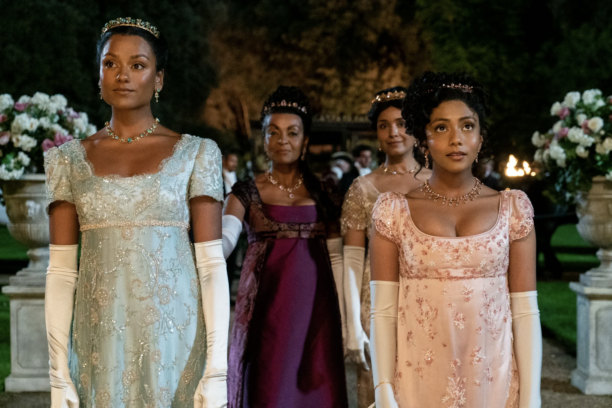
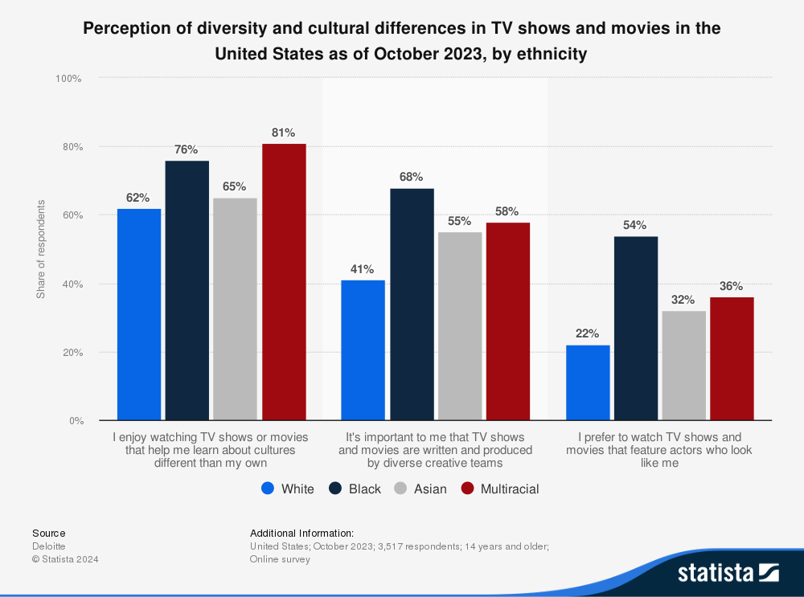
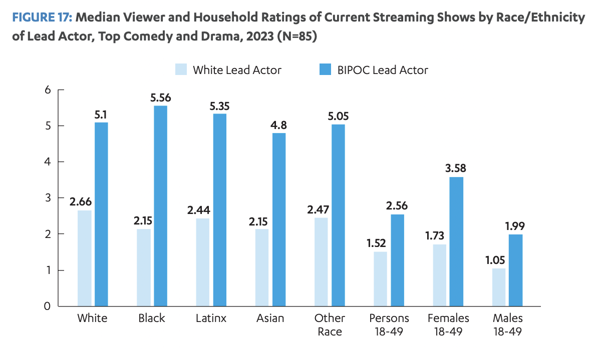
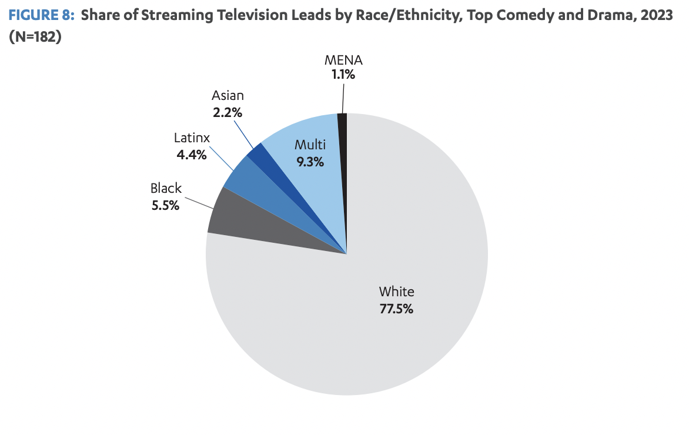
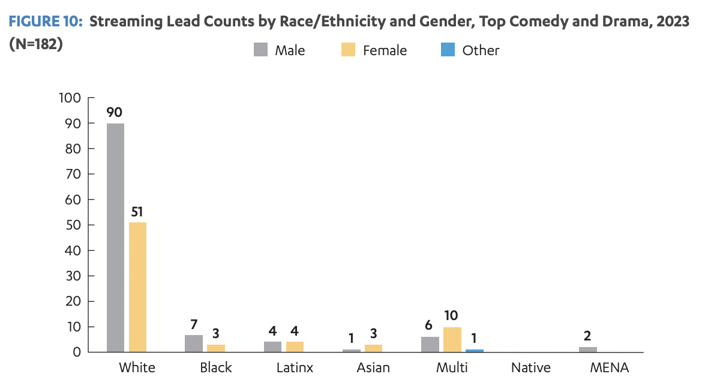

| [home page](https://cmustudent.github.io/tswd-portfolio-templates/) | [data viz examples](dataviz-examples) | [critique by design](critique-by-design) | [final project I](final-project-part-one) | [final project II](final-project-part-two) | [final project III](final-project-part-three) |

# Wireframes / storyboards
> Using your sketches developed last week, further develop your story outline and relevant components visually through the use of wireframing / storyboards. Using your outline as a guide, include high-fidelity, individual draft data visualizations of the critical elements of your story you want to share with your reader. Note: you can build these elements out directly in Shorthand this week if you wish.  Reminder: this template is intended to help, but it doesn't substitute for reading through the full homework assignment!  The assignment page on Canvas includes many important details for completing Part II of the final project. 

**Set Up**

Across all ethnicities in the US, 70% or higher proportion have a generally balanced to very positive perception of diversity in entertainment, TV, and movies that adults watch.

<noscript></noscript><object class='tableauViz'  style='display:none;'><param name='host_url' value='https%3A%2F%2Fpublic.tableau.com%2F' /> <param name='embed_code_version' value='3' /> <param name='site_root' value='' /><param name='name' value='Howonscreendiversityisperceived&#47;
Sheet1' /><param name='tabs' value='no' /><param name='toolbar' value='yes' /><param name='static_image' value='https:&#47;&#47;public.tableau.com&#47;static&#47;images&#47;Ho&#47;Howonscreendiversityisperceived&#47;
Sheet1&#47;1.png' /> <param name='animate_transition' value='yes' /><param name='display_static_image' value='yes' /><param name='display_spinner' value='yes' /><param name='display_overlay' value='yes' /><param name='display_count' value='yes' /><param name='language' value='en-US' /><param name='filter' value='publish=yes' /></object>
     

*(Liam Daniel/Netflix)*

Shows featuring casts and storylines that represent a wide range of ethnic and racial backgrounds have gained traction, challenging long-standing industry norms. This change has been driven by evolving societal attitudes, changing demographics, and a growing recognition of the importance of authentic storytelling. 

A relatively high proportion (60~80%) of viewers, regardless of ethnicity, enjoy learning about multiple cultures and care about diversity in production. Although lower (20~50%), some also care about being represented on screen as well. As a result, diverse representation in TV series has become a key factor in attracting and retaining audiences across various demographics.

*(Mark Seliger/Disney)*

**Conflict**

Despite evidence of growing interest, higher ratings, and demand for inclusive content, 

many TV shows still fall short when it comes to adequate ethnic and racial diversity in their casts and storylines. 

This disconnect between audience preferences and demographics to on-screen representation not only fails to reflect the realities of modern society but also misses opportunities to engage with broader audiences and tap into new markets.

**Resolution**

Increased production and green-lighting of shows with diverse representation will lead to more successful TV series and better audience engagement.

<noscript></noscript><object class='tableauViz'  style='display:none;'><param name='host_url' value='https%3A%2F%2Fpublic.tableau.com%2F' /> <param name='embed_code_version' value='3' /> <param name='site_root' value='' /><param name='name' value='Tvgenrefavorability&#47;Sheet2' /><param name='tabs' value='no' /><param name='toolbar' value='yes' /><param name='static_image' value='https:&#47;&#47;public.tableau.com&#47;static&#47;images&#47;Tv&#47;Tvgenrefavorability&#47;
Sheet2&#47;1.png' /> <param name='animate_transition' value='yes' /><param name='display_static_image' value='yes' /><param name='display_spinner' value='yes' /><param name='display_overlay' value='yes' /><param name='display_count' value='yes' /><param name='language' value='en-US' /><param name='filter' value='publish=yes' /></object>
     

To ensure success, data about which genres are preferred across ethnicities can be referenced when making decisions. For example, Action and Comedy is a well-favored genre across all ethnicities, with over 80% favorability

# User research 

## Target audience
> Include your approach to identifying representative individuals, and who you hope to reach with your story. 

Text here!

## Interview script
> List the goals from your research, and the questions you intend to ask. 

Text here!

| Goal | Questions to Ask |
|------|------------------|
|      |                  |
|      |                  |
|      |                  |

Text here!

## Interview findings
> Detail the findings from your interviews.  Do not include PII.  Capture specific insights where possible.

Text here!

| Questions               | Interview 1 (briefly describe) | Interview 2 | Interview 3 |
|-------------------------|--------------------------------|-------------|-------------|
| Question you asked here | Insightful feedback            |             |             |
|                         |                                |             |             |
|                         |                                |             |             |

# Identified changes for Part III
> Document the changes you plan on implementing next week to address any issues identified.  

Text here!

| Research synthesis                       | Anticipated changes for Part III                                                |
|------------------------------------------|---------------------------------------------------------------------------------|
| Findings or observations from interviews | Describe what, if any changes you anticipate making to address the observation. |
|                                          |                                                                                 |
|                                          |                                                                                 |
|                                          |                                                                                 |
| ...add more rows as necessary            |                                                                                 |

> ...include any final thoughts you have here. 

Text here!

# Moodboards / personas
> If you did this optional part, include details here.  Otherwise remove this section

Text here!

## References
_List any references you used here._

## AI acknowledgements
_If you used AI to help you complete this assignment (within the parameters of the instruction and course guidelines), detail your use of AI for this assignment here._

