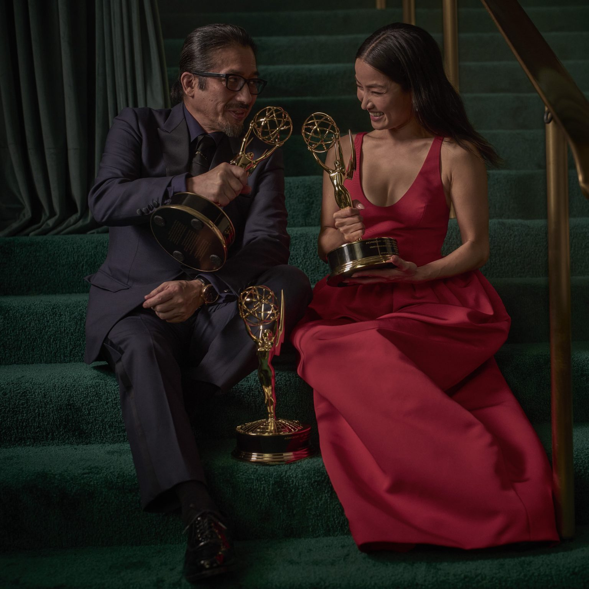

| [home page](https://cheejulee.github.io/christine-dataviz-portfolio/) | [data viz examples](dataviz-examples) | [critique by design](critique-by-design) | [final project I](final-project-part-one) | [final project II](final-project-part-two) | [final project III](final-project-part-three) |

# Wireframes / storyboards
> Using your sketches developed last week, further develop your story outline and relevant components visually through the use of wireframing / storyboards. Using your outline as a guide, include high-fidelity, individual draft data visualizations of the critical elements of your story you want to share with your reader. Note: you can build these elements out directly in Shorthand this week if you wish.  Reminder: this template is intended to help, but it doesn't substitute for reading through the full homework assignment!  The assignment page on Canvas includes many important details for completing Part II of the final project. 

**Set Up**

Across all ethnicities in the US, 70% or higher proportion have a generally balanced to very positive perception of diversity in entertainment, TV, and movies that adults watch.

<noscript></noscript><object class='tableauViz'  style='display:none;'><param name='host_url' value='https%3A%2F%2Fpublic.tableau.com%2F' /> <param name='embed_code_version' value='3' /> <param name='site_root' value='' /><param name='name' value='Howonscreendiversityisperceived&#47;
Sheet1' /><param name='tabs' value='no' /><param name='toolbar' value='yes' /><param name='static_image' value='https:&#47;&#47;public.tableau.com&#47;static&#47;images&#47;Ho&#47;Howonscreendiversityisperceived&#47;
Sheet1&#47;1.png' /> <param name='animate_transition' value='yes' /><param name='display_static_image' value='yes' /><param name='display_spinner' value='yes' /><param name='display_overlay' value='yes' /><param name='display_count' value='yes' /><param name='language' value='en-US' /><param name='filter' value='publish=yes' /></object>
     

*(Liam Daniel/Netflix)*

Shows featuring casts and storylines that represent a wide range of ethnic and racial backgrounds have gained traction, challenging long-standing industry norms. This change has been driven by evolving societal attitudes, changing demographics, and a growing recognition of the importance of authentic storytelling. 

A relatively high proportion (60~80%) of viewers, regardless of ethnicity, enjoy learning about multiple cultures and care about diversity in production. Although lower (20~50%), some also care about being represented on screen as well. As a result, diverse representation in TV series has become a key factor in attracting and retaining audiences across various demographics.

*(Mark Seliger/Disney)*

**Conflict**

Despite evidence of growing interest, higher ratings, and demand for inclusive content, 

many TV shows still fall short when it comes to adequate ethnic and racial diversity in their casts and storylines. 

This disconnect between audience preferences and demographics to on-screen representation not only fails to reflect the realities of modern society but also misses opportunities to engage with broader audiences and tap into new markets.

**Resolution**

**Increased production and green-lighting of shows with diverse representation will lead to more successful TV series and better audience engagement.**

<noscript></noscript><object class='tableauViz'  style='display:none;'><param name='host_url' value='https%3A%2F%2Fpublic.tableau.com%2F' /> <param name='embed_code_version' value='3' /> <param name='site_root' value='' /><param name='name' value='Tvgenrefavorability&#47;Sheet2' /><param name='tabs' value='no' /><param name='toolbar' value='yes' /><param name='static_image' value='https:&#47;&#47;public.tableau.com&#47;static&#47;images&#47;Tv&#47;Tvgenrefavorability&#47;
Sheet2&#47;1.png' /> <param name='animate_transition' value='yes' /><param name='display_static_image' value='yes' /><param name='display_spinner' value='yes' /><param name='display_overlay' value='yes' /><param name='display_count' value='yes' /><param name='language' value='en-US' /><param name='filter' value='publish=yes' /></object>
     

To ensure success, data about which genres are preferred across ethnicities can be referenced when making decisions. For example, Action and Comedy is a well-favored genre across all ethnicities, with over 80% favorability

# User research 

## Target audience
> Include your approach to identifying representative individuals, and who you hope to reach with your story. 

My main target audience are television industry professionals, including producers, writers, and network executives. Some other target audiences are media critics and analysts as well as adult viewers interested in diversity and representation in television. With this story, I am hoping to reach decision-makers in the television industry who can influence casting and content choices, advocacy groups focused on media representation, general audience members who care about diversity in the shows they watch, even aspiring actors and creators from underrepresented groups who hope to benefit from increased diversity, and of course researchers and academics studying media representation. By targeting these groups, the project can effectively raise awareness about the importance of diversity in television and potentially inspire changes in the industry to improve representation. 

## Interview script
> List the goals from your research, and the questions you intend to ask. 

My goals with the set-up are to clearly and concisesly show how audiences are favoring highly diverse shows and that they are successful in terms of ratings. Then in the conflict, I will highlight the disconnect between audience preferences for diverse representation in television and the actual diversity in TV shows. Lastly with the resolution I plan to demonstrate the potential benefits of increased diversity in TV series production which will encourage the television industry to produce more shows with diverse representation.

Questions to ask:
1. Which data visualization was most compelling in telling the story of diversity representation in TV?
2. Is there anything you find surprising or confusing?
3. Are there any points where the flow could be improved to enhance understanding?
4. Who do you think is the intended audience?

## Interview findings
> Detail the findings from your interviews.  Do not include PII.  Capture specific insights where possible.

Interviewee 1: White male, Tepper student
Interviewee 2: White female, MEIM student
Interviewee 3: Asian female, MEIM student

| Questions| Interview 1 | Interview 2 | Interview 3 |
|----------|-------------|-------------|-------------|
| 1 |bar chart showing the high percentage of positive perception of diversity|high percentage (60-80%) of viewers who enjoy learning about multiple cultures|genre preferences across ethnicities, actionable|
| 2 |the disconnect between audience preferences and actual representation, expected the industry to be more responsive to viewer demands|gap between industry and audience preference|low percentage (20-50%) of viewers who care about being represented on screen, expected higher rate|
| 3 |concrete examples of successful diverse shows|title of graphs could be more specific, specific data on the financial success of diverse shows|impact on international markets|
| 4 |TV industry executives|executives, future entertainment industry professionals|executives, MEIM students|

# Identified changes for Part III
> Document the changes you plan on implementing next week to address any issues identified.  

| Research synthesis                       | Anticipated changes for Part III                                                |
|------------------------------------------|---------------------------------------------------------------------------------|
|Gap or disconnect between audience preference and industry mentioned twice|emphasizing in the beginning for shock factor and hook|
|Titles of graphs lacking important details|Add year and country, other elements to help understanding|
|Interest in specific shows for examples noted|Do more research on shows that were diverse and successful, add more visual aspects and information incorporating these shows|

## References

Deloitte. (March 19, 2024). Perception of diversity and cultural differences in TV shows and movies in the United States as of October 2023, by ethnicity [Graph]. In Statista. Retrieved February 11, 2025, from https://www.statista.com/statistics/1474646/diversity-cultural-differences-tv-shows-movies-by-ethnicity-us/

Ipsos. (November 29, 2023). Perception of diversity in entertainment, TV, and movies adults watch in the United States as of August 2023, by ethnicity [Graph]. In Statista. Retrieved February 11, 2025, from https://www.statista.com/statistics/815789/public-opinion-diversity-film-tv-by-ethnicity/

Kaloi, Stephanie. “UCLA Study Finds 80% of Top Streaming Series Led by White Actors.” TheWrap (blog), December 17, 2024. https://www.thewrap.com/ucla-hollywood-diversity-report-2024-streaming-series-white-leads/.

Morning Consult. (November 27, 2018). Favorability of selected television show genres among adults in the United States as of November 2018, by ethnicity [Graph]. In Statista. Retrieved February 05, 2025, from https://www-statista-com.cmu.idm.oclc.org/statistics/948548/preferred-tv-show-types-in-the-us-by-ethnicity/

## AI acknowledgements
_If you used AI to help you complete this assignment (within the parameters of the instruction and course guidelines), detail your use of AI for this assignment here._

